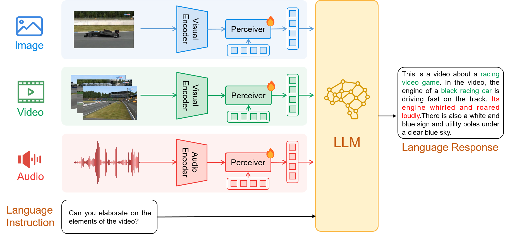

# ChatBridge
 ChatBridge, an approach to learning a unified multimodal model to interpret, correlate, and reason about various modalities without relying on all combinations of paired data.


<a href='https://iva-chatbridge.github.io'></a>  <a href='https://arxiv.org/abs/2305.16103'></a> 


## Introduction
ChatBridge is a multimodal language model capable of perceiving real-world multimodal information, 
as well as following instructions, thinking, and interacting with humans in natural language.
Inspired by <a href="https://arxiv.org/abs/2204.14198">Flamingo</a> and <a href="https://arxiv.org/abs/2301.12597">BLIP-2</a>, 
we introduce perceiver modules to bridge the encoders and the LLM. 
we choose open-sourced <a href="https://lmsys.org/blog/2023-03-30-vicuna/">Vicuna-13B</a> as the LLM, 
which is built upon LLaMA, and reported to achieve 90% of ChatGPT's quality as per GPT-4's evaluation. 
As for the modal-specific encoders, we choose <a href="https://arxiv.org/abs/2211.07636">EVA-ViT-G</a> as the vision encoder to encode images and videos, 
and <a href="https://arxiv.org/abs/2212.09058">BEAT</a> as the audio encoder to encoder audios.

- Stage 1: Bridge each modality with language, leverage large-scale language-paired two-modality data for multimodal 
    alignment training, including image-text, video-text, and audio-text pairs.
- Stage 2: Multimodal Instruction Tuning, instruction-finetune ChatBridge to align the model with user intent on a 
    multimodal instruction dataset MULTIS, enabling more effective zero-shot generalization on multimodal tasks.

      




## Examples
  <!-- |   |   |
:-------------------------:|:-------------------------:
 |  
  |   -->

More examples can be found in the [project page](https://iva-chatbridge.github.io).


## Getting Started
### Installation


**1. Prepare the code and the environment**

Git clone our repository, creating a python environment and activate it via the following command

```bash
git clone https://github.com/joez17/ChatBridge.git
cd ChatBridge
conda env create -f environment.yml
conda activate chatbridge
```

**1.1 Prepare BEATs iter**
`mkdir beats_weights`
`cd beats_weights`
`wget https://huggingface.co/nsivaku/nithin_checkpoints/resolve/main/BEATs_iter3_plus_AS2M.pt?download=true -O BEATs_iter3_plus_AS2M.pt`

**2. Prepare the pretrained Vicuna weights**

Please refer to MiniGPT-4's instruction [here](https://github.com/Vision-CAIR/MiniGPT-4/blob/main/PrepareVicuna.md) 
to prepare the Vicuna-13B weights.
The final weights would be in a single folder in a structure similar to the following:

```
vicuna_weights
├── config.json
├── generation_config.json
├── pytorch_model.bin.index.json
├── pytorch_model-00001-of-00003.bin
...   
```

Then, set the path to the vicuna weight in the model config file [eval_configs/chatbridge_eval.yaml](eval_configs/chatbridge_eval.yaml).

**3. Prepare the pretrained checkpoint**

Download the pretrained checkpoints
[Baidu](https://pan.baidu.com/s/1msC9UrlmezzBh_UQ1o9wHg) key:o4v9.


Then, set the path to the pretrained checkpoint in the evaluation config file 
in [eval_configs/chatbridge_eval.yaml](eval_configs/chatbridge_eval.yaml). 


### Training
The training of ChatBridge contains two alignment stages.

**1. First pretraining stage**

We use three kind of datasets to train ChatBridge in the first stage, including image-text datasets(CC, LAION), video-text datasets(Webvid-2.5M) 
and audio-text datasets(Wavcaps). 
To download and prepare the datasets, please check 
our [first stage dataset preparation instruction](custom_datasets/valor_data/DATASET.md). 
After the first stage, the multi-modal features are mapped and can be understood by the language
model.

To launch the first stage training, run the following command. In our experiments, we use 8 A100. 
You can change the save path in the config file 
[train_configs/chatbridge_pretrain.yaml](train_configs/chatbridge_pretrain.yamll)

```bash
torchrun --nproc-per-node NUM_GPU train.py --cfg-path train_configs/chatbridge_pretrain.yaml
```

A ChatBridge checkpoint with only stage one training can be downloaded 
[here](https://drive.google.com/file/d/1u9FRRBB3VovP1HxCAlpD9Lw4t4P6-Yq8/view?usp=share_link).


**2. Second finetuning stage**

In the second stage, we use a small high quality instruction dataset MULTIS created by ourselves
and convert it to a conversation format.
To download and prepare our second stage dataset, please check our 
[second stage dataset preparation instruction](custom_datasets/valor_data/DATASET.md).
To launch the second stage alignment, 
first specify the path to the checkpoint file trained in stage 1 in 
[instructiontuning_configs/instructtuning_ivaavchat_ckpt13.yaml](instructiontuning_configs/instructtuning_ivaavchat_ckpt13.yaml).
You can also specify the output path there. 
Then, run the following command. 
```bash
torchrun --nproc-per-node NUM_GPU train.py --cfg-path instructiontuning_configs/instructtuning_ivaavchat_ckpt13.yaml
```

### Launching Demo Locally

Try out our demo [demo.py](demo.py) on your local machine by running

```
python demo.py --cfg-path eval_configs/chatbridge_eval.yaml  --gpu-id 0
```

## MULTIS Data

We provide re-organized text annotation files in MULTIS datasets in this [googledrive_link](https://drive.google.com/file/d/1C7k8flfITJ1GxMwFSvEmBFGyevDZl1ke/view?usp=drive_link) or [baiduyun_link](https://pan.baidu.com/s/1GsUi4yLsBBEjkGu-4nwngw) key:2gt3.

please check our 
[second stage dataset preparation instruction](custom_datasets/valor_data/DATASET.md) for more details.


## Acknowledgement

+ [BLIP2](https://huggingface.co/docs/transformers/main/model_doc/blip-2) The model architecture of ChatBridge follows BLIP-2. Don't forget to check this great open-source work if you don't know it before!
+ [Lavis](https://github.com/salesforce/LAVIS) This repository is built upon Lavis!
+ [Vicuna](https://github.com/lm-sys/FastChat) The fantastic language ability of Vicuna with only 13B parameters is just amazing. And it is open-source!
+ [MiniGPT4](https://github.com/Vision-CAIR/MiniGPT-4) and [LLaVA](https://github.com/haotian-liu/LLaVA). We utilize their instruction data and drew inspiration from their approach to design a more comprehensive multimodal instruction dataset. They are all open-source!


If you're using ChatBridge in your research or applications, please cite using this BibTeX:
```bibtex
@article{zhao2023chatbridge,
  title={ChatBridge: Bridging Modalities with Large Language Model as a Language Catalyst},
  author={Zhao, Zijia and Guo, Longteng and Yue, Tongtian and Chen, Sihan and Shao, Shuai and Zhu, Xinxin and Yuan, Zehuan and Liu, Jing},
  journal={arXiv preprint arXiv:2305.16103},
  year={2023}
}
```


## License
This repository is under [BSD 3-Clause License](LICENSE.md).
Many codes are based on [Lavis](https://github.com/salesforce/LAVIS) with 
BSD 3-Clause License [here](LICENSE_Lavis.md).